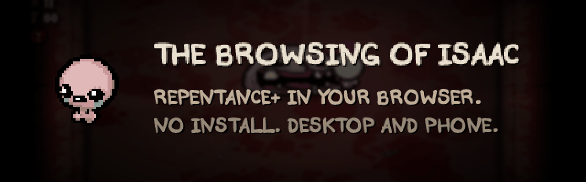
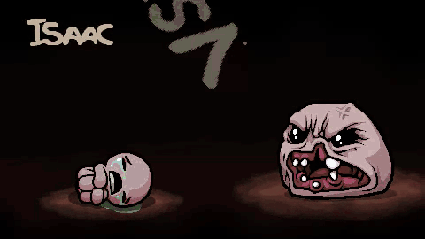
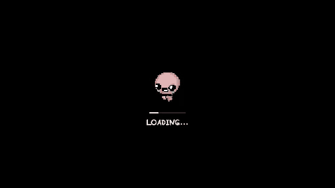
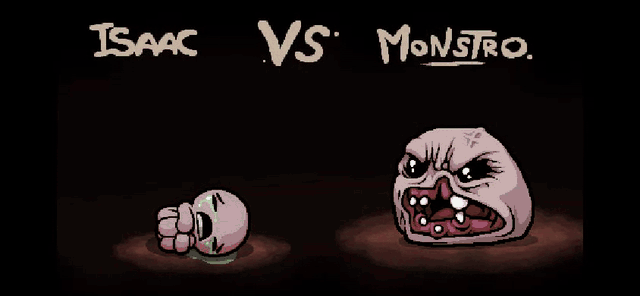

### The Binding of Isaac: Repentance+, running in your browser.
Desktop or phone. Nothing to install.

## What is this?

The real *Repentance+*, the original game code translated to WebAssembly, playing in a browser tab.
It is not a remake and not an emulator: every room, item, synergy and bug behaves the way it does on PC.

- 🎮 **Play anywhere.** Keyboard on desktop, touch on phones and tablets.
- 📱 **Built for touch.** Sticks under your thumbs, the game's own HUD as your buttons, and your phone buzzes on hits and explosions.
- 💾 **Your runs are kept.** Progress lives in your browser. Export or import a save file any time.
- 🧩 **Mods.** Browse and install mods from the game's own MODS screen.
- ⚡ **Instant.** No download, no plugin, no account.

## 📱 On your phone

&nbsp;&nbsp;

There are no on-screen buttons: you touch the game itself.

| To | Do this |
| --- | --- |
| Move and shoot | Left thumb moves, right thumb fires |
| Use an item, card, pill or bomb | Tap it in the item bar under the room |
| Swap items | Tap the small second item |
| Drop a card or trinket | Hold it |
| Open the map | Tap the minimap; hold it to peek |
| Pause | Tap the paper mark next to the map |
| Get around the menus | Tap what you want, swipe to scroll, two fingers to go back |

Rumble follows the game's own **Options → Rumble** setting.

## ⌨️ On desktop

| Key | Action |
| --- | --- |
| <kbd>W</kbd> <kbd>A</kbd> <kbd>S</kbd> <kbd>D</kbd> | Move |
| <kbd>←</kbd> <kbd>↑</kbd> <kbd>→</kbd> <kbd>↓</kbd> | Shoot |
| <kbd>Space</kbd> / <kbd>Q</kbd> / <kbd>E</kbd> | Active item / card or pill / bomb |
| <kbd>Ctrl</kbd> | Swap; hold to drop |
| <kbd>Tab</kbd> | Map |
| <kbd>Esc</kbd> | Pause / back |
| <kbd>F</kbd> | Fullscreen |

## 🌐 What you need

A current Chrome, Edge or other Chromium-based browser on desktop or Android.
The game needs WebAssembly JSPI and WebGL 2, and the page tells you if your browser can't run it.

## 💾 Saves and mods

- Saves stay in the browser you play in. On the file screen, **EDIT FILE** exports a file to a `.zip` or imports one, including a `.dat` save from PC.
- On the **MODS** screen, tap the **MOD BROWSER** note (or press <kbd>B</kbd>): search, read what a mod does, and install it with a tap. A `.zip` or a mod folder from your device works too.

## 🛠️ For developers

How the game becomes a web page, how to build it from your own copy, and how releases go out: **[docs/DEVELOPING.md](docs/DEVELOPING.md)**.

The short version

A static recompilation of the Windows x86 executable to WebAssembly: Ghidra p-code → C → Emscripten, with a host layer for Win32, OpenGL, OpenAL and the C runtime.
Nothing is emulated and no gameplay is rewritten.
**This repository contains no game data, lifted sources or compiled module**, and local builds need your own copy of the game.

## ⭐ Star history

<a href="https://www.star-history.com/#chiikabu/the-browsing-of-isaac&Date">
  <picture>
    <source media="(prefers-color-scheme: dark)" srcset="https://api.star-history.com/svg?repos=chiikabu/the-browsing-of-isaac&type=Date&theme=dark">
    <source media="(prefers-color-scheme: light)" srcset="https://api.star-history.com/svg?repos=chiikabu/the-browsing-of-isaac&type=Date">
    
  </picture>
</a>

## Credits

- *The Binding of Isaac: Repentance+* by Edmund McMillen and Nicalis.
- The loading screen's dance is the [Specialist dance](https://tenor.com/view/isaac-tboi-dance-gif-7352492888219360785) by dazlex.
- Function signatures from [REPENTOGON](https://github.com/TeamREPENTOGON/REPENTOGON)'s libzhl.

## Disclaimer

*The Binding of Isaac: Repentance+* belongs to Nicalis, Inc. and Edmund McMillen.
This project is not affiliated with or endorsed by them.
The tools operate on a copy you already own, and their output is not redistributable.
Personal project, no warranty.
