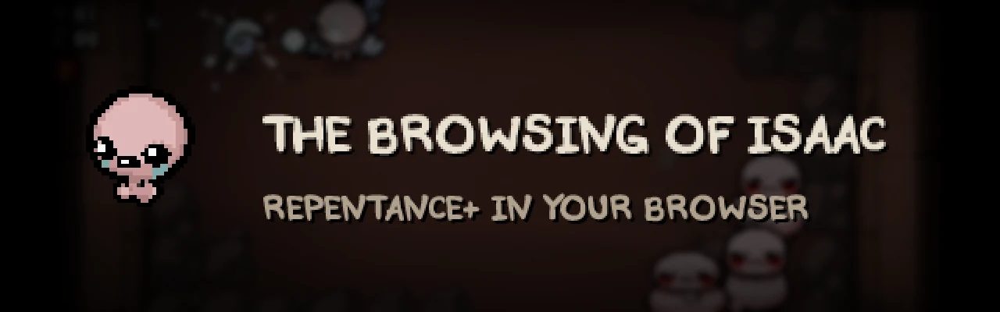

**The Binding of Isaac: Repentance+, playable in a browser tab.**

This is the real Repentance+ game code, recompiled from the Windows executable
to WebAssembly. It's not a remake and not an emulator, so every item, synergy
and bug works the way it does on PC.

It runs on desktop and on phones, keeps your saves in the browser, and can
install mods from the game's own MODS menu.

## On a phone

  &nbsp;
  

There are no extra buttons on screen; you play by touching the game.

| | |
| --- | --- |
| Move, shoot | Left thumb, right thumb |
| Active item, card or pill, bomb | Tap it in the bar under the room |
| Swap items | Tap the small second item |
| Drop a card or trinket | Hold it |
| Map | Tap the minimap, or hold it to peek |
| Pause | The paper icon next to the map |
| Menus | Tap, swipe to scroll, two fingers to go back |

Vibration follows the game's Rumble option.

## On a keyboard

| Key | |
| --- | --- |
| <kbd>W</kbd> <kbd>A</kbd> <kbd>S</kbd> <kbd>D</kbd> | Move |
| <kbd>←</kbd> <kbd>↑</kbd> <kbd>→</kbd> <kbd>↓</kbd> | Shoot |
| <kbd>Space</kbd> | Active item |
| <kbd>Q</kbd> | Card or pill |
| <kbd>E</kbd> | Bomb |
| <kbd>Ctrl</kbd> | Swap, hold to drop |
| <kbd>Tab</kbd> | Map |
| <kbd>Esc</kbd> | Pause |
| <kbd>F</kbd> | Fullscreen |

## Saves and mods

Saves stay in the browser you play in. **EDIT FILE** on the file select screen
exports a save or imports one, including a `.dat` save from PC.

On the **MODS** screen, tap **MOD BROWSER** (or press <kbd>B</kbd>) to search
and install mods, or add one from a `.zip` or folder.

## Browsers

Chrome, Edge and other Chromium browsers, on desktop or Android. If your browser
can't run it, the page says so.

## Building it yourself

You need your own copy of the game; this repository has no game files in it.
[docs/DEVELOPING.md](docs/DEVELOPING.md) covers the build.

## Star history

<a href="https://www.star-history.com/#chiikabu/the-browsing-of-isaac&Date">
  <picture>
    <source media="(prefers-color-scheme: dark)" srcset="https://api.star-history.com/svg?repos=chiikabu/the-browsing-of-isaac&type=Date&theme=dark">
    <source media="(prefers-color-scheme: light)" srcset="https://api.star-history.com/svg?repos=chiikabu/the-browsing-of-isaac&type=Date">
    
  </picture>
</a>

## Credits

- Ported by shisa.
- *The Binding of Isaac: Repentance+* is by Edmund McMillen and Nicalis.
- The loading screen dance is the [Specialist dance](https://tenor.com/view/isaac-tboi-dance-gif-7352492888219360785) by dazlex.
- Function signatures from [REPENTOGON](https://github.com/TeamREPENTOGON/REPENTOGON).

*The Binding of Isaac* belongs to Nicalis, Inc. and Edmund McMillen. This is a fan
project, not affiliated with or endorsed by them.
